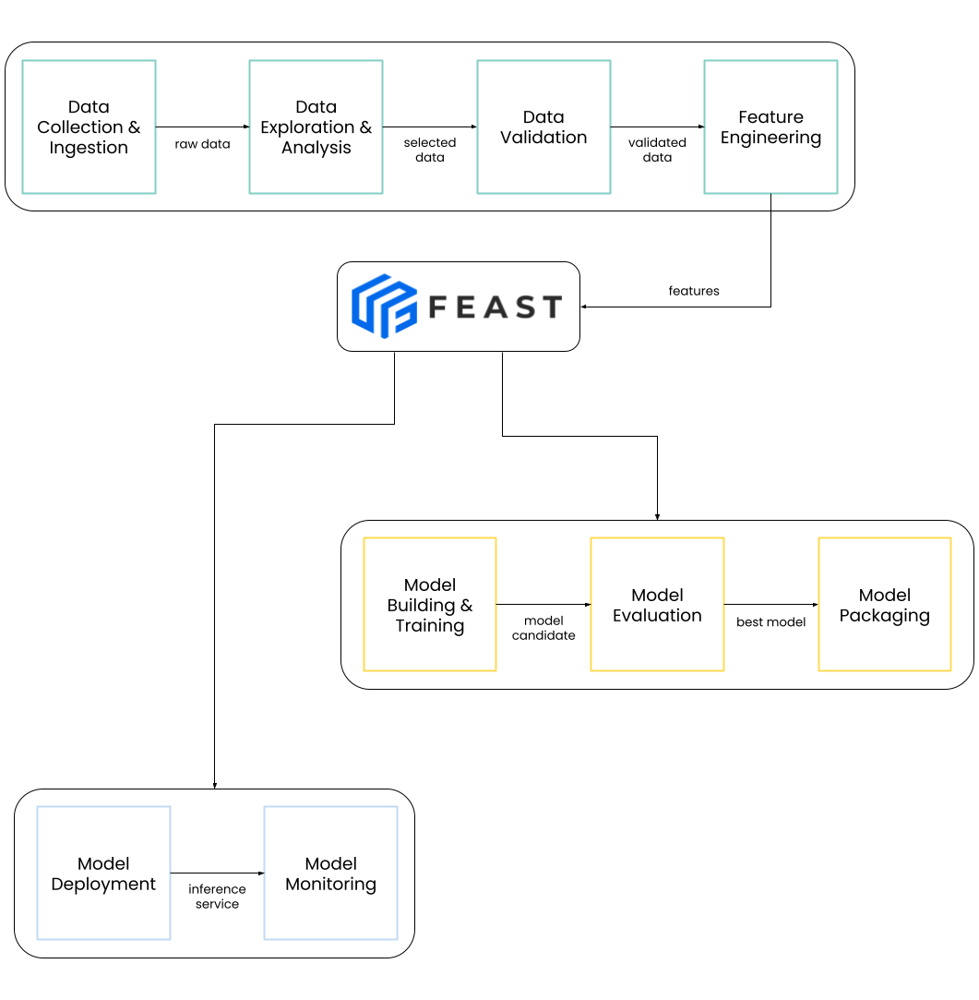

# Feast User Guide

## Feature Stores

### What are the features in ML?

The features are representations or encodings of data, usually raw data, in a different form from the original. They act as input variables to a model either during training or inference.

Further Reading:

[What are Features in Machine Learning?](https://vitalflux.com/what-are-features-in-machine-learning/)

### What is the feature store?

The feature store is where the features are stored and organized for the explicit purpose of being used to either train models or make predictions. It is an ml-specific data system where multiple users can define features in a standard way, register them in a central registry, and access them consistently for model training and inference.

Further Reading:

[What is a Feature Store?](https://www.tecton.ai/blog/what-is-a-feature-store/)

[What is a Feature Store for ML?](https://medium.com/data-for-ai/what-is-a-feature-store-for-ml-29b62580af5d)

[Feature Store 101](https://medium.com/data-for-ai/feature-store-101-b964373891c4)

[MLOps: Continuous delivery and automation pipelines in machine learning](https://cloud.google.com/architecture/mlops-continuous-delivery-and-automation-pipelines-in-machine-learning#feature_store)

### Why use the feature store?

**Consistent Features**

The feature store provides a serving layer that makes feature values consistently available both for training and inference purposes, helping solve the very common training-serving skew problem. It does so by using two database systems, one scale-out SQL database intended for batch training and another low latency store, which contains only the latest feature data, intended for lightning fast inference.

**Avoid Data Leakage**

The feature store is responsible for generating point-in-time correct feature sets thus avoiding data leakage. It uses time-series data and handles the complex joins that ensure point-in-time correctness. 
Data scientists can solely focus on feature engineering rather than implementing the complex dataset join logic.

**Portable Models**

The feature store is the layer between models and data that standardizes how models retrieve features from data sources. It decouples ml models from data infrastructure by providing a single data access layer that abstracts feature storage from feature retrieval, ensuring models remain portable.

**Fast Feature Creation**

The feature store allows data scientists to iterate quickly on features. It allows them to discover new features and build on top of existing ones. They can share their work and reduce the time and resources spent on feature engineering. Once you get to combine features as Lego blocks, you will understand the true value of a feature store.

Further Reading:

[Training-Serving Skew](https://developers.google.com/machine-learning/guides/rules-of-ml#training-serving_skew)

[Data Leakage in Machine Learning](https://machinelearningmastery.com/data-leakage-machine-learning/)

[Point-in-Time Correctness in Real-Time Machine Learning](https://towardsdatascience.com/point-in-time-correctness-in-real-time-machine-learning-32770f322fb1)

## Feast

### What is Feast?

[Feast](https://docs.feast.dev/#what-is-feast) is an open-source feature store. It is a customizable operational data system that reuses existing infrastructure to manage and serve machine learning features to realtime models.

### What Feast is not?

Feast aims to be a customizable system that doesn’t rely on vendor specific components and that is easy to start with. Thus, it has some limitations and it isn’t:
- an ETL / ELT system.
- a data orchestration tool
- a data warehouse
- a database

Further Reading:

[What Feast is not?](https://docs.feast.dev/#what-feast-is-not)

### How is Feast structured?

Feast has basically three main components:
1. Registry
2. Offline Store
3. Online Store

The Registry is a central catalog of all the feature definitions and their related metadata.

The Offline Store is usually a data warehouse that contains historical time-series feature data.

The Online Store is usually a fast key-value store that contains only the latest feature data.

The Feast SDK/CLI is responsible for managing and coordinating these three components.

Further Reading:

[Feast Architecture Overview](https://docs.feast.dev/getting-started/architecture-and-components/overview)

[Feast Concepts Overview](https://docs.feast.dev/getting-started/concepts/overview)

### What do we offer on Feast?

We integrated Feast into Kubeflow as another plug-in component. More specifically, we turned Feast into a client-server system by building a Registry server and adding an access control layer. Multiple clients can now interact securely with the Registry server and share and discover features effectively. Previously, sharing features while also enforcing access control was not a true option and a [Git repository approach](https://docs.feast.dev/how-to-guides/running-feast-in-production#1.-automatically-deploying-changes-to-your-feature-definitions) was used to manage feature definitions.

We followed a similar approach to Kubeflow Pipelines (KFP) and users can now grant access to Feast resources (entities, feature views, feature services, etc.) the same way they do with KFP resources (pipelines, experiments, etc.).

## Setup in Kubeflow

To set up the Feast Registry in Kubeflow follow parts A and B of the [Feast x Kubeflow Demo guide](https://github.com/arrikto/prv-feast/tree/feature-kubeflow/examples/kubeflow-demo).

## Usage

The following diagram shows how a typical machine learning workflow looks like. It is a process that starts with data engineering, continues with model training and ends with model deployment.

A feature store like Feast, splits the above ML workflow into smaller independent workflows.

Thus, Feast allows independent iteration on these smaller workflows making it easier for teams to focus on a specific part of the ML workflow and cooperate effectively. Data engineers focus on creating new features, data scientists build new models and DevOps engineers deploy the models in production.

Let’s now get some hands-on experience and prove how Feast can act as the glue component of the above workflows. 

### How to enhance feature engineering?

#### Register Feature Definitions

After data engineers create new features and store them in the Offline Store, they can register them in the Registry using Python code. This way the features are discoverable and available to Feast clients that have the right permissions.

Go through **data-workflow.ipynb** and run it as a pipeline using Kale to learn more.

#### Continuous Feature Engineering

Most of the time, businesses continuously gather raw data that need to be converted into features to provide actual value. Thus, we need a mechanism that constantly creates fresh feature values. We can do so by setting up **Recurring Runs**.

Try doing so by configuring a daily run of the **data-workflow** pipeline that you created previously using Kale.

### How to accelerate model training?

#### Access Features Consistently

When training models we want to be able to control the datasets we use in an efficient way. We want to be able to consistently fetch features for reproducibility purposes and not have to worry about complex point-in-time joins. The Feast SDK offers the *get_historical_features()* method that does the work for you.

Go through **model-workflow.ipynb** and run it as a pipeline using Kale to learn more.

#### Continuous Model Training

In production machine learning systems we usually notice degradation in a model’s performance. Most of the time this happens due to changes of feature data we pass as input to the model. Thus, we need to retrain the model using the latest feature data and fine tune it accordingly. Using Feast we can easily specify a date interval and get only the feature data that belong to this interval to create the training dataset.

Pay attention to the *START_DATE* and *END_DATE* variables we use to set this interval in **model-workflow.ipynb** and set up a **Recurring Run** of the notebook to retrain your model periodically, always fetching the feature data of the last 30 days.

### How to improve model predictions?

#### Deploy Inference Service

After creating a model we want to deploy it in production and make sure it gets the latest feature data. We will use the Online Store to do so. More specifically, we spin up an inference service that uses a transformer to fetch the latest feature data and pass it to the model as input.

Go through the **serve-workflow.ipynb** to find out more about model deployment with Feast.

**Note**: The service account of the inference service must have “read” access to the required feature definitions. At the moment, the **default** service account is used and does **NOT** have permissions.

**Latest News**: Feast supports the creation of [feature servers](https://docs.feast.dev/reference/feature-servers) (e.g. Python Feature Server) that provide the latest feature values through HTTP.

#### Keep Features Fresh

Keeping features fresh is very important for a model’s success. For this reason, we need to keep the Online Store fresh. To do so, we use the materialization process (push latest feature data from Offline to Online Store).

Go through the **materialization.ipynb** and run it as a pipeline using Kale to learn more. Set the pipeline as a **Recurring Run** to keep the features fresh based on your needs.

**Latest News**: Feast supports the use of [batch materialization engines](https://docs.feast.dev/reference/batch-materialization) that keep the feature values fresh.

### How to combine everything in Kubeflow?

Until now, we presented the basic functionalities of Feast without making use of the new sharing capabilities.

Go through part C of the [Feast x Kubeflow Demo guide](https://github.com/arrikto/prv-feast/blob/feature-kubeflow/examples/kubeflow-demo/README.md#part-c-demo) and see how using Feast helps engineers and teams collaborate and share features.

## Other Resources

Videos Playlist:

[Bridging Models and Data](https://youtu.be/6OCUMbEtSLU)

[Accelerating Machine Learning with a Feature Store](https://youtu.be/9jaRoj4AeU8)

[Rethinking Feature Stores with Feast and Tecton](https://www.youtube.com/watch?v=qh7bh4YVI2E&list=PLZlqSy0QcQCaM7PDB_itrAPgDHsQMqFlu&index=3)

Audio Playlists:

[The Feast Podcast - MLOps Open Source Feature Stores](https://open.spotify.com/show/5yrDPRmum3DyZlgYWDkJEU)

[Feature Stores at Shopify and Skyscanner](https://open.spotify.com/episode/48txxv7kwxyEF0296LCmCM)

Blogs:

[Common Feature Store Workflow with Feast](https://medium.com/dkatalis/common-feature-store-workflow-with-feast-6698ea666fe8)
