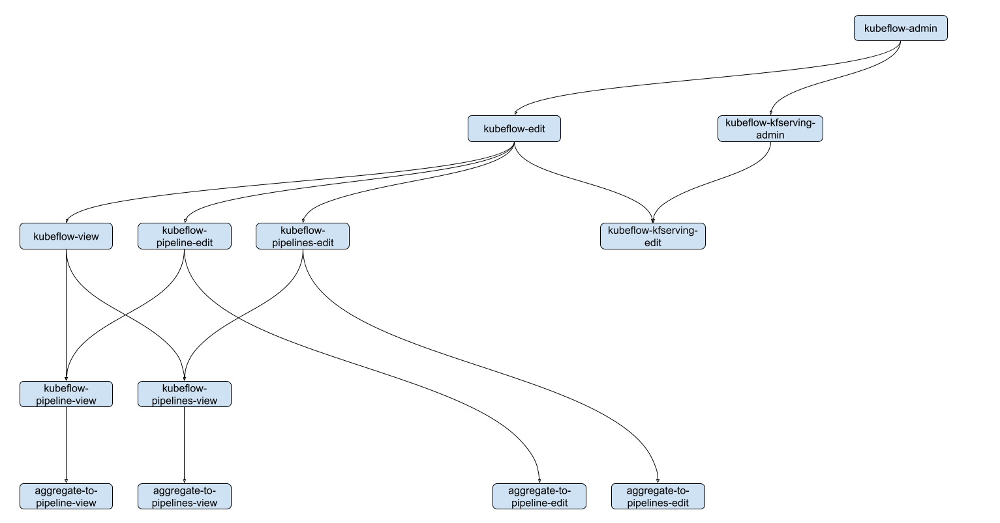

# Configure Permissions Help Guide

## Existing Role Hierarchy

In a Kubernetes environment there are two categories of users: service
accounts managed by Kubernetes and normal users. The users have permissions
based on the roles they are assigned to through role bindings. Roles contain
rules that define permissions to perform actions on specific resources.
In addition, Kubernetes allows building a role hierarchy where parent roles
contain one or more child roles forming essentially a tree.

This is the typical Kubeflow user's namespace role hierarchy and service
accounts:


We can see that every user who owns a namespace has the `kubeflow-admin`
role that contains the `kubeflow-edit` and `kubeflow-view` roles. Let's
also observe  the `default-viewer` and `default-editor` service accounts
of each namespace and how they are tied to the aforementioned roles.

This is a part of the existing role hierarchy:



The `kubeflow-edit` role contains multiple `*-edit` roles and the
`kubeflow-view` role. The `kubeflow-view` role contains multiple `*-view`
roles. Most of the `*-edit` roles contain a `*-view` role.

## New Roles and Rules

Following the existing role hierarchy we add the following roles:
- kubeflow-feature-edit
- aggregate-to-feature-edit
- kubeflow-feature-view
- aggregate-to-feature-view


`kubeflow-feature-edit`: This is an intermediate ClusterRole which aggregates
all the rules from child ClusterRoles e.g. `aggregate-to-feature-edit`. It
also has a label which specifies that this role’s rules should be aggregated
with `kubeflow-edit` ClusterRole.

```
apiVersion: rbac.authorization.k8s.io/v1
kind: ClusterRole
metadata:
  labels:
    rbac.authorization.kubeflow.org/aggregate-to-kubeflow-edit: "true"
  name: kubeflow-feature-edit
aggregationRule:
  clusterRoleSelectors:
  - matchLabels:
      rbac.authorization.kubeflow.org/aggregate-to-kubeflow-feature-edit: "true"
rules: []
```

`aggregate-to-feature-edit`:

```
apiVersion: rbac.authorization.k8s.io/v1
kind: ClusterRole
metadata:
  labels:
    rbac.authorization.kubeflow.org/aggregate-to-kubeflow-feature-edit: "true"
  name: aggregate-to-feature-edit
rules:
- apiGroups:
  - features.kubeflow.org
  resources:
  - data_sources
  - entities
  - feature_services
  - feature_views
  - infra_objects
  - on_demand_feature_views
  - projects
  - request_feature_views
  - saved_datasets
  verbs:
  - create
  - update
  - delete
```

Following the same pattern `kubeflow-feature-view` and
`aggregate-to-feature-view` ClusterRoles are defined. This time
`kubeflow-feature-view` is aggregated with `kubeflow-view` and
`kubeflow-feature-edit` ClusterRole:

```
apiVersion: rbac.authorization.k8s.io/v1
kind: ClusterRole
metadata:
  labels:
    rbac.authorization.kubeflow.org/aggregate-to-kubeflow-feature-edit: "true"
    rbac.authorization.kubeflow.org/aggregate-to-kubeflow-view: "true"
  name: kubeflow-feature-view
aggregationRule:
  clusterRoleSelectors:
  - matchLabels:
      rbac.authorization.kubeflow.org/aggregate-to-kubeflow-feature-view: "true"
rules: []
```

```
apiVersion: rbac.authorization.k8s.io/v1
kind: ClusterRole
metadata:
  labels:
    rbac.authorization.kubeflow.org/aggregate-to-kubeflow-feature-view: "true"
  name: aggregate-to-feature-view
rules:
- apiGroups:
  - features.kubeflow.org
  resources:
  - data_sources
  - entities
  - feature_services
  - feature_views
  - infra_objects
  - on_demand_feature_views
  - projects
  - request_feature_views
  - saved_datasets
  verbs:
  - get
  - list
```

Summarizing:
1. **features.kubeflow.org** has been defined as an `apiGroup`
2. The following 9 **resources** have been defined:
   - data_sources
   - entities
   - feature_services
   - feature_views
   - infra_objects
   - on_demand_feature_views
   - projects
   - request_feature_views
   - saved_datasets
3. The following 5 **verbs** have been defined:
   - create
   - get
   - update
   - delete
   - list

By default namespace owners have permissions to execute all actions (see
verbs list above) to all registry objects (see resources list above) of
their namespace.

## Permisions scenarios

This section contains examples that present how granting access can be
implemented in different scenarios. The scenarios are the following:
- Private
- View all resources
- Edit all resources
- View specific resources
- Edit specific resources
- Share resources with everyone

### Private

This scenario is already presented and is the default one. Users expect
to edit and view resources in their namespace, while other users should
not be able to view or edit them. No extra configuration is needed.

### View All Resources

In order to share view access to all resources in a namespace with another
user or service account a new role binding should be created:

```
apiVersion: rbac.authorization.k8s.io/v1
kind: RoleBinding
metadata:
  name: default-viewer-share-all
  namespace: kubeflow-user
roleRef:
  apiGroup: rbac.authorization.k8s.io
  kind: ClusterRole
  name: kubeflow-feature-view
subjects:
- kind: User
  name: system:serviceaccount:kubeflow-user-a:default-editor
  apiGroup: rbac.authorization.k8s.io
```

or

```
apiVersion: rbac.authorization.k8s.io/v1
kind: RoleBinding
metadata:
  name: default-viewer-share-all
  namespace: kubeflow-user
roleRef:
  apiGroup: rbac.authorization.k8s.io
  kind: ClusterRole
  name: kubeflow-feature-view
subjects:
- kind: ServiceAccount
  name: default-editor
  namespace: kubeflow-user-a
```

### Edit All Resources

In order to share edit access to all resources in a namespace with another
user or service account a new role binding should be created:

```
apiVersion: rbac.authorization.k8s.io/v1
kind: RoleBinding
metadata:
  name: default-editor-share-all
  namespace: kubeflow-user
roleRef:
  apiGroup: rbac.authorization.k8s.io
  kind: ClusterRole
  name: kubeflow-feature-edit
subjects:
- kind: User
  name: system:serviceaccount:kubeflow-user-a:default-editor
  apiGroup: rbac.authorization.k8s.io
```

or

```
apiVersion: rbac.authorization.k8s.io/v1
kind: RoleBinding
metadata:
  name: default-editor-share-all
  namespace: kubeflow-user
roleRef:
  apiGroup: rbac.authorization.k8s.io
  kind: ClusterRole
  name: kubeflow-feature-edit
subjects:
- kind: ServiceAccount
  name: default-editor
  namespace: kubeflow-user-a
```

### View Specific Resources

In order to share view access to specific resources in a namespace with
another user or service account a new role and a new role binding should
be created:

```
apiVersion: rbac.authorization.k8s.io/v1
kind: Role
metadata:
  labels:
  namespace: kubeflow-user
  name: kubeflow-feature-view-specific
rules:
- apiGroups:
  - features.kubeflow.org
  resources:
  - entities
  resourceNames:
  - entity_1
  - entity_2
  verbs:
  - get
  - list
```

```
apiVersion: rbac.authorization.k8s.io/v1
kind: RoleBinding
metadata:
  name: default-viewer-share-specific
  namespace: kubeflow-user
roleRef:
  apiGroup: rbac.authorization.k8s.io
  kind: Role
  name: kubeflow-feature-view-specific
subjects:
- kind: User
  name: system:serviceaccount:kubeflow-user-a:default-editor
  apiGroup: rbac.authorization.k8s.io
```

### Edit Specific Resources

In order to share edit access to specific resources in a namespace with
another user or service account a new role and a new role binding should
be created:

```
apiVersion: rbac.authorization.k8s.io/v1
kind: Role
metadata:
  labels:
  namespace: kubeflow-user
  name: kubeflow-feature-edit-specific
rules:
- apiGroups:
  - features.kubeflow.org
  resources:
  - entities
  resourceNames:
  - entity_1
  - entity_2
  verbs:
  - create
  - update
  - delete
  - get
  - list
```

```
apiVersion: rbac.authorization.k8s.io/v1
kind: RoleBinding
metadata:
  name: default-editor-share-specific
  namespace: kubeflow-user
roleRef:
  apiGroup: rbac.authorization.k8s.io
  kind: Role
  name: kubeflow-feature-edit-specific
subjects:
- kind: User
  name: system:serviceaccount:kubeflow-user-a:default-editor
  apiGroup: rbac.authorization.k8s.io
```

### Share Resources with Everyone

To share resources with all users (everyone) you can use the following subjects in the created role bindings:

```
subjects:
- kind: Group
  name: system:authenticated
  apiGroup: rbac.authorization.k8s.io
- kind: Group
  name: system:unauthenticated
  apiGroup: rbac.authorization.k8s.io
```